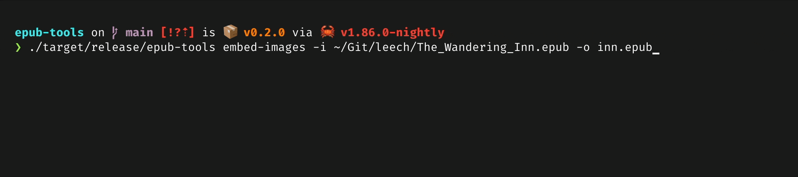

# 🛠️ epub-tools

Some tools for working with ePub files. Works for me, may not work for you. Pull requests welcome.

## Tools

There is currently one tool: `embed-images`. This will embed all externally-referenced images (e.g. ``) into the ePub file. It will also optimize the images while downloading for a specific device profile (the default is the Kindle Paperwhite 2024).

It's very fast. Handles an extremely large ePub (750 HTML files, 2.5k images) in ~3 seconds when cached:



## Installing

Pre-built binaries are available for most platforms on the [releases page](https://github.com/codetheweb/epub-tools/releases). I recommend using [Eget](https://github.com/zyedidia/eget) to download the appropriate binary:

```bash
eget codetheweb/epub-tools
```

Otherwise, install from source with Cargo:

```bash
cargo install --git https://github.com/codetheweb/epub-tools.git
```
